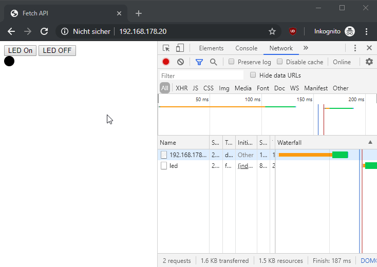
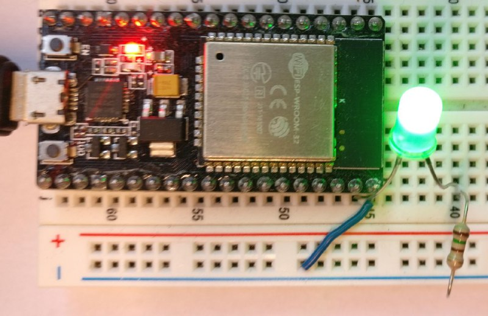

# Esp32WebLed
micropython, esp32, webserver, led, json 

- micro python backend
- HTML/JS frontend to turn LED on/off
- handel basic http request and respond with micro webapp
- handel REST style POST-request with JSON body to update LED status

1. install micropython on esp32 (https://docs.micropython.org/en/latest/esp32/tutorial/intro.html)
1. configure ip, ssid and password in boot.py
1. upload boot.py, main.py and index.html to esp32 ( for example with: https://marketplace.visualstudio.com/items?itemName=pycom.Pymakr)
1. reboot and enter ip in browser
2. connect led to pin 23  
   
